# Merimba Outdoor — Panduan Deploy & Dokumentasi Sistem

Dokumen ini berisi: (1) hasil audit keamanan menyeluruh, (2) panduan deploy ke InfinityFree dengan domain `merimbaoutdoor.gt.tc`, (3) flowchart lengkap seluruh alur sistem — dari cara customer memesan sampai cara admin mengelola inventaris, (4) ringkasan struktur sistem, dan (5) penjelasan database lewat phpMyAdmin.

File ini sengaja diblokir dari akses browser langsung lewat `.htaccess` (`Require all denied` untuk ekstensi `.md`). Jangan hapus aturan itu.

---

## 1. Audit Keamanan (OWASP Top 10)

Audit dilakukan terhadap seluruh file PHP dalam project ini, menyisir setiap kategori yang diminta. Status akhir: **semua celah yang ditemukan sudah diperbaiki**, dan tercatat di bawah untuk transparansi.

### 1.1 Ringkasan per kategori

| Kategori | Status | Catatan |
|---|---|---|
| SQL Injection (termasuk Blind & Stored) | Aman | 100% pakai PDO prepared statement dengan parameter terikat. Tidak ada satu pun query yang menyambung input user langsung ke string SQL. |
| XSS (Stored, Reflected, DOM) | Aman | Input disaring lewat `clean_input()` (htmlspecialchars saat masuk) DAN output di-escape lagi lewat `htmlspecialchars()` saat ditampilkan — dua lapis. |
| CSRF | Aman | Semua endpoint POST yang mengubah data (`aksi/*.php`) memverifikasi token CSRF (random 32-byte, dibandingkan pakai `hash_equals` supaya tahan timing attack). |
| SSRF | N/A | Aplikasi tidak pernah membuat request HTTP keluar berdasarkan input user. |
| RCE | Aman | Tidak ada `include`/`require` yang memakai path dari input user. |
| LFI / RFI | Aman | Sama seperti di atas. |
| Directory Traversal | Aman | Semua file yang diserve (foto produk, identitas, bukti bayar) memakai nama file acak buatan server (`bin2hex(random_bytes(16))`), nama asli dari user tidak pernah dipakai untuk path. |
| Command Injection | Aman | Satu-satunya `exec()` (fitur backup database) memakai `escapeshellarg()` untuk setiap parameter, password dikirim lewat environment variable (tidak muncul di process list). |
| File Upload Attack | Aman | Lihat detail di 1.2. |
| MIME Bypass | Aman | Tipe file dideteksi dari isi file (`finfo`), bukan dari header `Content-Type` yang dikirim browser. |
| Double Extension Upload | Aman | Ekstensi file simpanan ditentukan dari MIME type asli, bukan dari nama file asli. |
| SVG Upload Attack | Aman | SVG tidak ada di whitelist (`image/jpeg`, `image/png`, `image/webp` saja). |
| PHP Upload Attack | Aman | Ekstensi `.php` tidak mungkin lolos (lihat MIME Bypass & Double Extension di atas). |
| Zip Bomb | N/A | Tidak ada fitur upload/ekstrak arsip di aplikasi ini. |
| Session Fixation | Aman | `session_regenerate_id(true)` dipanggil tepat saat login berhasil. |
| Session Hijacking | Aman | Cookie `HttpOnly`, `Secure` otomatis aktif kalau HTTPS, `SameSite=Lax`, session ID di-rotate tiap 30 menit. |
| Cookie Security | Aman | `Session::destroy()` menghapus cookie di browser, bukan cuma data sesi di server. |
| Privilege Escalation | Aman | Sistem memaksa hanya ada **1 akun Owner** — peran "Owner" tidak bisa dipilih untuk anggota baru maupun promosi, dan akun tidak bisa mengubah peran dirinya sendiri. Admin Operasional boleh mengubah status akunnya sendiri, tapi dibatasi hanya Aktif/Cuti (Nonaktif tetap eksklusif keputusan Owner). |
| Broken Authentication | Aman | Password di-hash bcrypt cost 12. Perbandingan password pakai dummy-hash supaya waktu respons "akun tidak ada" dan "password salah" sama. |
| Broken Access Control / Authorization | Aman | Lihat detail IDOR di 1.3. |
| IDOR | Aman | `invoice.php` dan `lanjutkan-reservasi.php` wajib memakai kode booking acak (≈16 juta kombinasi) + nomor HP, bukan `booking_id` yang bisa ditebak. |
| Mass Assignment | Aman | Semua fungsi update (`TeamModel`, `CustomerModel`, `ItemModel`) memakai whitelist kolom eksplisit. |
| Clickjacking | Aman | Header `X-Frame-Options: DENY` aktif di semua halaman. |
| Open Redirect | Aman | Semua tujuan redirect berasal dari nilai tetap di kode, bukan dari input user. |
| HTTP Header Injection | Aman | Tidak ada input user mentah yang disisipkan ke header respons. |
| Rate Limiting | Aman | Login member & admin dibatasi 5 percobaan gagal per identitas, lockout 5 menit, tersimpan di tabel `login_attempts`. |
| Brute Force | Aman | Dilindungi rate limiting di atas. |
| Password Policy | Aman | Minimal 8 karakter (mengikuti NIST 800-63B: panjang lebih penting daripada aturan kompleksitas simbol/angka). |
| Enumeration | Diketahui, bukan bug | Form registrasi memberi tahu kalau nomor HP/email sudah terdaftar — trade-off standar UX registrasi. Login sudah dilindungi lewat timing-safe dummy hash. |
| DOS | Di luar cakupan kode aplikasi | Perlindungan DDoS skala besar adalah tanggung jawab infrastruktur hosting (lihat 2.6). Rate limiting login sudah mencegah DOS lewat spam percobaan login. |
| Business Logic Abuse | Aman | Locking database (`SELECT ... FOR UPDATE`) mencegah oversell stok saat checkout bersamaan; item dengan riwayat sewa tidak bisa dihapus permanen. |
| JWT | N/A | Sistem tidak memakai JWT, autentikasi berbasis session PHP native. |
| Remember Me | N/A | Fitur ini tidak ada di aplikasi. |
| Reset Password | N/A | Belum ada reset password otomatis — link "Lupa kata sandi" mengarahkan untuk menghubungi Owner secara manual. Pilihan desain yang aman (tidak ada celah token reset), dicatat sebagai keterbatasan fitur. |

### 1.2 Detail: File Upload Security

Semua upload gambar (foto produk, logo, QRIS, identitas/KTP, bukti bayar) melewati validasi berlapis yang sama:

1. Cek `$file['error'] === UPLOAD_ERR_OK`.
2. Cek ukuran maksimal (5MB identitas/bukti bayar, 3MB foto produk/logo/QRIS).
3. Deteksi tipe file SEBENARNYA lewat `finfo_open(FILEINFO_MIME_TYPE)` — baca byte asli file, bukan header `Content-Type` dari browser.
4. Whitelist ketat: `image/jpeg`, `image/png`, `image/webp` saja.
5. Validasi tambahan lewat `getimagesize()`.
6. Ekstensi file yang DISIMPAN ditentukan dari MIME type terdeteksi, bukan nama file asli.
7. Nama file final: `bin2hex(random_bytes(16))` + ekstensi.
8. Folder tujuan dipisah per jenis (`assets/images/produk/`, `assets/images/qris/`, `assets/images/logo/`, `storage/identitas/`).
9. Folder `storage/` (identitas KTP & bukti bayar) diblokir total dari akses browser langsung lewat `storage/.htaccess`.

Sejak audit awal, sistem upload di seluruh halaman (form-barang, pengaturan, checkout, checkout-kasir, pembayaran) sudah distandarkan lewat satu komponen bersama `assets/js/image-uploader.js` — preview thumbnail langsung + tombol hapus bulat mengambang, konsisten di semua tempat. Validasi backend di atas tidak berubah sama sekali oleh komponen ini (murni tampilan/preview sisi client).

### 1.3 Detail: Perbaikan IDOR (Broken Access Control)

**Sebelum**: `invoice.php?booking_id=5&hp=08xxxxxxxxxx` — `booking_id` angka urut gampang ditebak.

**Sesudah**: Wajib memakai `kode` (kode booking acak, format `MRB-XXXXXX`) + `hp`, lewat `BookingModel::getByKodeDanHp()`.

**Catatan tambahan (nomor HP berganti)**: kalau member mengganti nomor HP-nya sendiri lewat halaman akun saat masih ada sewa yang berjalan, nomor LAMA tetap bisa dipakai untuk `getByKodeDanHp()` — tapi **hanya untuk booking yang statusnya belum final** (bukan SELESAI/EXPIRED/DIBATALKAN). Begitu booking itu selesai, hanya nomor baru yang berlaku. Ini mencegah member kehilangan akses cek booking di tengah masa sewa akibat ganti nomor, tanpa membuka celah permanen dari nomor lama yang mungkin sudah pindah tangan (daur ulang provider).

### 1.4 Portabilitas path (bukan celah keamanan, tapi WAJIB diperbaiki sebelum deploy)

Beberapa file (`header.php`, `header-admin.php`, `footer.php`, `dashboard.php`, `detail-barang.php`, `pengaturan.php`, `struk-*.php`) sebelumnya memakai path absolut berawalan subfolder lokal development (mis. `href="/nama-folder-lokal/dashboard.php"`) — ini hanya benar kalau aplikasi diakses lewat server lokal dengan subfolder tertentu. Kalau di-deploy ke domain sendiri (root domain, bukan subfolder), semua link/CSS/icon itu akan 404. **Sudah diperbaiki**: seluruh path absolut tersebut diganti jadi path relatif (tanpa slash di depan), sama seperti mayoritas file lain di project ini yang sudah benar sejak awal. Sekarang aplikasi berjalan identik baik diakses dari server lokal maupun dari root domain manapun, tanpa perlu ubah kode apa pun antar lingkungan.

### 1.5 Verifikasi menyeluruh

- Seluruh file PHP — lulus `php -l` (tidak ada syntax error).
- Header keamanan (`X-Frame-Options: DENY`, `X-Content-Type-Options: nosniff`, `Referrer-Policy`) aktif di semua halaman.
- Proteksi `.htaccess` terhadap file sensitif (`.sql`, `.md`, `.log`, `.env`, `.json`, `.lock`, folder `app/`, `config/`, `storage/`).

---

## 2. Panduan Deploy ke InfinityFree — domain `merimbaoutdoor.gt.tc`

Detail konfigurasi hosting (dari Control Panel InfinityFree):

| Item | Nilai |
|---|---|
| Domain | `merimbaoutdoor.gt.tc` |
| Document root | `htdocs/` |
| MySQL Hostname | Lihat Control Panel InfinityFree → MySQL Databases |
| MySQL Username | Lihat Control Panel InfinityFree → MySQL Databases |
| MySQL Database | Lihat Control Panel InfinityFree → MySQL Databases |
| MySQL Port | `3306` |

> **Catatan**: Username/hostname akun MySQL dan **password MySQL sengaja TIDAK ditulis di file ini** — file ini akan ikut ter-upload ke server dan bisa saja suatu saat berakhir di tempat lain (backup, repo publik, dsb). Ambil semua kredensial langsung dari Control Panel InfinityFree → Hosting Account → MySQL Databases setiap kali dibutuhkan, atau simpan sendiri di password manager pribadi.

### 2.1 Yang HARUS diunggah

Unggah **seluruh isi folder project lokal** (folder tempat kode aplikasi ini berada di komputer development) ke folder `htdocs/` di File Manager InfinityFree, **kecuali** yang disebutkan di 2.2. File Manager InfinityFree mendukung upload folder/multi-file langsung dari browser.

### 2.2 Yang TIDAK BOLEH ikut diunggah

| Item | Kenapa tidak boleh ikut |
|---|---|
| Folder konfigurasi editor/IDE lokal (`.vscode/`, dsb.) | Konfigurasi tool development lokal, bukan bagian aplikasi. |
| `.git/` (folder tersembunyi) | Riwayat version control, tidak dibutuhkan untuk menjalankan aplikasi, dan besar. |
| `config/database.php` (isi lama) | Berisi kredensial database LOKAL (development). Ganti dengan kredensial InfinityFree — lihat 2.4. |
| `storage/identitas/*` (isi file, bukan foldernya) | Data pribadi pelanggan dari testing lokal. Foldernya (dengan `.htaccess` di dalamnya) tetap harus ada, kosongkan isinya. |
| `storage/backup-bukti-pembayaran/*` (isi file, bukan foldernya) | Arsip ZIP backup bukti pembayaran dari testing lokal (fitur Backup di halaman Laporan). Foldernya (dengan `.htaccess` di dalamnya) tetap harus ada, kosongkan isinya. |
| `storage/*.sql` | Backup database lokal, tidak relevan di server produksi. |
| File scratch/testing yang tidak dipakai aplikasi (mis. halaman percobaan HTML sisa development) | Bukan bagian aplikasi. |

Sebelum upload, dari komputer lokal hapus dulu file placeholder bawaan InfinityFree yang ada di `htdocs/` (biasanya berupa file penjelasan singkat + `index2.html`) — keduanya bukan bagian aplikasi ini.

### 2.3 Langkah upload

1. Login ke **InfinityFree Control Panel** → **Manage merimbaoutdoor.gt.tc**.
2. Buka **File Manager**.
3. Masuk ke folder `htdocs/`. Hapus file placeholder bawaan (lihat 2.2).
4. Upload seluruh ISI folder project lokal (bukan folder pembungkusnya, tapi isinya) langsung ke `htdocs/`, supaya `index.php` ada tepat di `htdocs/index.php`.
5. Pastikan `.htaccess` di root dan `storage/.htaccess` ikut ter-upload (aktifkan "show hidden files" kalau perlu).

### 2.4 Setup Database

1. Buat/pastikan database produksi sudah ada (masih kosong). Buka **phpMyAdmin** dari tombol di halaman MySQL Databases Control Panel.
2. Pilih database produksi, lalu tab **Import** → pilih file `database/schema.sql` dari project ini → Go. Ini membuat semua tabel kosong, siap dipakai dari nol.
3. Edit `config/database.php` di server (lewat File Manager, klik kanan → Edit) — isi dengan kredensial dari Control Panel InfinityFree, formatnya:
   ```php
   <?php
   return [
       'host'     => 'ISI_HOSTNAME_MYSQL_DARI_CONTROL_PANEL',
       'port'     => '3306',
       'dbname'   => 'ISI_NAMA_DATABASE_DARI_CONTROL_PANEL',
       'username' => 'ISI_USERNAME_MYSQL_DARI_CONTROL_PANEL',
       'password' => 'ISI_PASSWORD_MYSQL_ANDA_DI_SINI', // dari Control Panel, jangan disimpan di git
       'charset'  => 'utf8mb4',
   ];
   ```
4. Buat akun Owner pertama lewat tab **SQL** di phpMyAdmin (ganti nama/email/no HP sesuai kebutuhan):
   ```sql
   INSERT INTO users (nama, email, no_hp, alamat, password_hash, role, status_aktif)
   VALUES ('Nama Owner', 'email@owner.com', '08xxxxxxxxxx', 'Alamat Owner', '$2y$12$HASH_BCRYPT_DI_SINI', 'owner', 'aktif');
   ```
   Cara membuat hash bcrypt: jalankan `php -r "echo password_hash('password_anda', PASSWORD_BCRYPT, ['cost'=>12]);"` di komputer mana pun yang ada PHP terpasang, salin hasilnya ke `HASH_BCRYPT_DI_SINI`.
5. Isi data usaha dasar (nama usaha, alamat, WhatsApp, dll.) lewat halaman **Pengaturan** setelah login sebagai Owner — atau langsung lewat tabel `settings` di phpMyAdmin kalau mau lebih cepat.

### 2.5 Setelah upload — checklist verifikasi

- [ ] Buka `https://merimbaoutdoor.gt.tc/` — homepage tampil tanpa error, logo/CSS/icon termuat dengan benar (ini yang tadinya berisiko rusak karena path absolut lama — sudah diperbaiki, lihat 1.4).
- [ ] Buka `https://merimbaoutdoor.gt.tc/config/database.php` — **harus** `403 Forbidden`.
- [ ] Buka `https://merimbaoutdoor.gt.tc/DEPLOY.md` — harus **403 Forbidden**.
- [ ] Buka `https://merimbaoutdoor.gt.tc/database/schema.sql` — harus **403 Forbidden**.
- [ ] Login sebagai Owner lewat `https://merimbaoutdoor.gt.tc/workspace-merimba.php`.
- [ ] Cek favicon tab browser muncul (huruf "M" putih di atas coklat).
- [ ] Coba tambah 1 barang di Inventaris lengkap dengan foto → foto muncul (folder `assets/images/produk/` harus bisa ditulis; InfinityFree biasanya otomatis benar, tidak perlu diubah manual kecuali muncul error permission).
- [ ] Coba registrasi 1 akun member percobaan, login, buka halaman Akun Saya (tab Profil/Keamanan/Tentang).
- [ ] Coba 1 reservasi percobaan end-to-end (booking → bayar → verifikasi admin → kembalikan).
- [ ] Coba transaksi Kasir percobaan, termasuk ketik nomor HP member yang sudah terdaftar dan cek saran "Gunakan data member ini" muncul.
- [ ] **Hapus semua data percobaan** di atas setelah selesai testing (lewat fitur Hapus Akun Pelanggan / Hapus Barang / langsung di phpMyAdmin), supaya data produksi tetap bersih.
- [ ] Aktifkan SSL/HTTPS gratis (Let's Encrypt) lewat Control Panel InfinityFree → SSL. Kode sudah otomatis mendeteksi HTTPS dan mengaktifkan flag `Secure` di cookie, tidak perlu ubah apa pun.
- [ ] Buka `https://merimbaoutdoor.gt.tc/halaman-yang-tidak-ada` → harus tampil halaman error 404 bergaya Merimba Outdoor (`error.php`), bukan halaman error polos bawaan server. Lihat catatan di bawah soal kenapa ini **tidak** bisa dites sama persis di localhost.

**Catatan soal `.htaccess` di InfinityFree**: dukungan `mod_headers` (dipakai untuk `X-Frame-Options` dkk.) bisa bervariasi tergantung paket hosting gratis. Cek langsung lewat DevTools → Network → Response Headers setelah deploy. Kalau tidak muncul, itu keterbatasan hosting gratis, bukan bug kode — pertimbangkan menambahkan Cloudflare (gratis) di depan domain untuk header keamanan tambahan.

**Catatan soal halaman error kustom (`error.php`) dan kenapa 403/500 tidak bisa dites 100% sama di localhost**: `.htaccess` mendaftarkan `ErrorDocument 400/401/403/404/429/500/503 /error.php`. Apache selalu mengartikan path berawalan `/` di sini relatif terhadap **document root server**, bukan folder tempat `.htaccess`-nya berada. Di produksi InfinityFree, document root **adalah** folder aplikasi ini sendiri (lihat tabel di 2.), jadi `/error.php` benar apa adanya. Di XAMPP lokal, document root biasanya `htdocs/` sedangkan aplikasi ada di subfolder `htdocs/morms/`, jadi Apache lokal mencari `htdocs/error.php` (tidak ada) alih-alih `htdocs/morms/error.php`.

Untuk kasus **404 (file/halaman benar-benar tidak ada)** — kasus paling umum — ini sudah diakali dengan `RewriteRule` (`mod_rewrite`) yang letaknya relatif terhadap folder `.htaccess` itu sendiri (bukan root-relative seperti `ErrorDocument`), jadi otomatis benar di localhost/morms MAUPUN produksi tanpa perlu ubah apa pun. Yang **masih** tidak bisa dites identik di localhost hanyalah kode error untuk file yang **sungguh ada** tapi ditolak/gagal di tahap lain — 403 dari blok `Require all denied` (mis. buka `.sql`/`.md` langsung), atau 500 dari PHP fatal error — karena keduanya baru masuk lewat jalur `ErrorDocument` yang root-relative tadi. Ini bukan bug, cuma keterbatasan cara kerja `ErrorDocument`. Untuk sekadar mengecek tampilan/desainnya di lokal, buka filenya langsung: `http://localhost:8080/morms/error.php` (halaman akan tampil sebagai 404 secara default).

### 2.6 Yang TIDAK bisa jalan di InfinityFree (keterbatasan hosting gratis)

- **Fitur Backup Database** (`Pengaturan → Backup`) memakai `exec()` untuk memanggil `mysqldump` — hosting gratis hampir pasti mematikan `exec()` demi keamanan bersama. Kalau tombol backup gagal, ini penyebabnya. Alternatif: **Export** manual berkala lewat phpMyAdmin.

---

## 3. Flowchart Alur Sistem

### 3.1 Alur Customer — Reservasi Online (Member & Tamu)

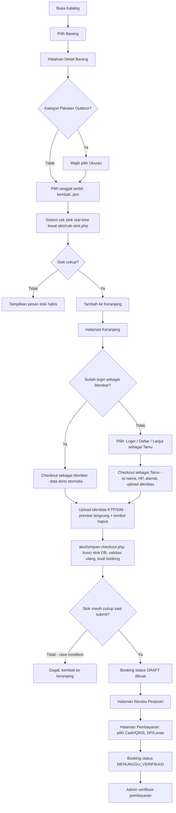

**Catatan keamanan**: penguncian stok (`SELECT ... FOR UPDATE`) terjadi tepat sebelum insert booking, di dalam satu database transaction — mencegah oversell. Untuk Pakaian Outdoor, penguncian per-ukuran (`item_variasi`).

### 3.2 Alur Customer — Booking Belum Selesai (DRAFT / Menunggu Pembayaran)

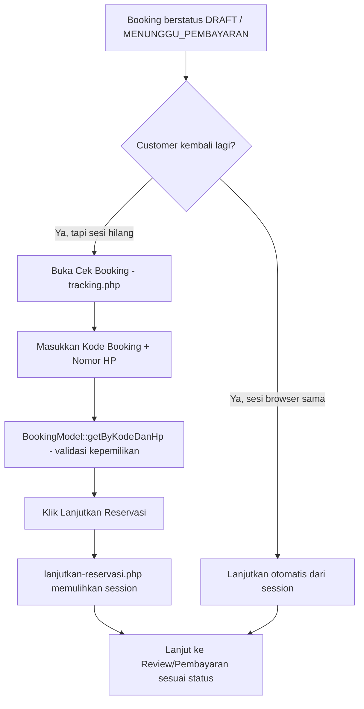

### 3.3 Alur Admin — Verifikasi Reservasi Online

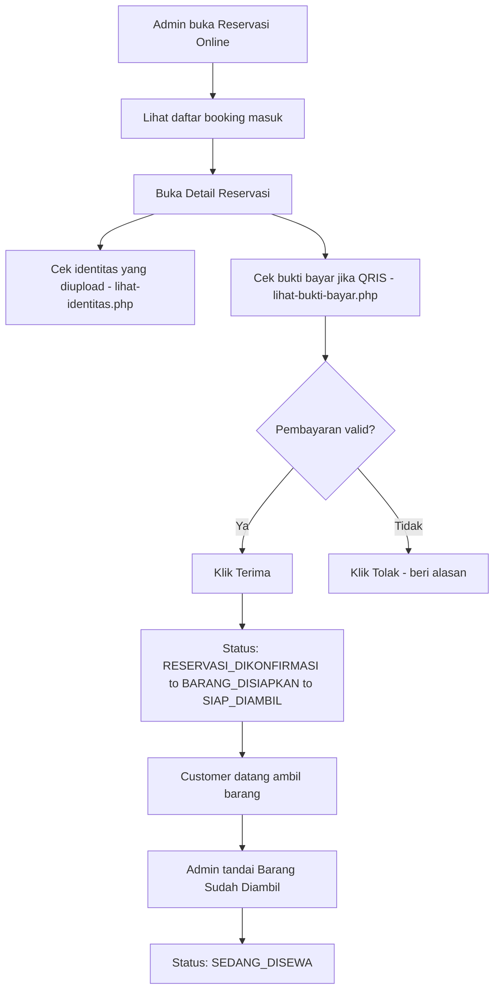

### 3.4 Alur Admin/Kasir — Transaksi Walk-in (dengan deteksi member)

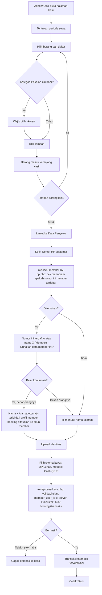

**Kenapa ini penting**: sebelumnya, transaksi walk-in SELALU tercatat sebagai "tamu" meskipun customer-nya member terdaftar — nomor HP yang sama bisa dipakai orang lain di lain waktu tanpa terdeteksi, dan riwayat transaksinya tidak nyambung ke akun member. Dengan fitur ini, kasir yang melihat langsung customer di depannya bisa mengonfirmasi identitas secara visual (lebih akurat daripada sistem menebak dari kecocokan nomor HP semata), dan begitu ditautkan, transaksi otomatis muncul di riwayat member yang benar serta terpisah dari data tamu.

### 3.5 Alur Admin — Pengembalian Barang

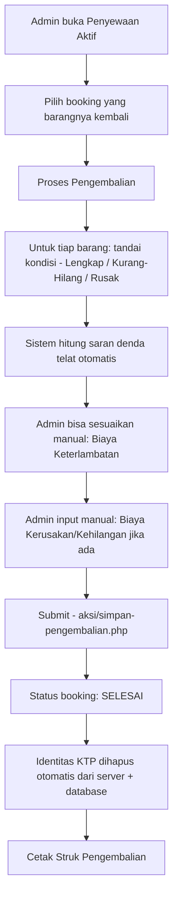

### 3.6 Alur Admin — CRUD Inventaris (lengkap)

```mermaid
flowchart TD
    subgraph CREATE["Tambah Barang Baru"]
        A1[Klik Tambah Barang] --> A2[Isi nama, kategori, harga, deskripsi]
        A2 --> A3{Kategori = Pakaian Outdoor?}
        A3 -->|Ya| A4[Isi Ukuran & Stok per baris]
        A3 -->|Tidak| A5[Isi Stok Total langsung]
        A4 --> A6[Stok Total dihitung otomatis]
        A6 --> A7[Upload foto - preview thumbnail langsung, bisa lebih dari satu]
        A5 --> A7
        A7 --> A8[aksi/simpan-barang.php: INSERT items + item_variasi + item_images]
    end

    subgraph READ["Lihat Inventaris"]
        B1[Halaman Inventaris] --> B2[Tabel: nama, kategori, harga, stok, status]
        B2 --> B3[Toggle switch Aktif/Nonaktif langsung dari tabel]
    end

    subgraph UPDATE["Edit Barang"]
        C1[Klik Edit] --> C2[form-barang.php?id=X]
        C2 --> C3[Ubah data: nama/harga/deskripsi/status]
        C3 --> C4[Simpan Perubahan]
        C2 --> C5[Kelola Foto - tambah foto baru tanpa hapus yang lama]
        C5 --> C6[aksi/tambah-foto-barang.php]
        C2 --> C7[Hapus foto satuan - tombol X bulat mengambang di tiap thumbnail]
        C7 --> C8[aksi/hapus-gambar-barang.php]
    end

    subgraph DELETE["Hapus Barang"]
        D1[Scroll ke bagian Hapus Barang] --> D2{Barang punya riwayat sewa?}
        D2 -->|Ya| D3[Tombol hapus disembunyikan - hanya bisa nonaktifkan]
        D2 -->|Tidak| D4[Klik Hapus Barang Ini]
        D4 --> D5[Ketik CONFIRM]
        D5 --> D6[aksi/hapus-barang.php: DELETE items - foto ikut terhapus dari disk]
    end
```

### 3.7 Alur Admin/Owner — CRUD Pelanggan (Member & Tamu)

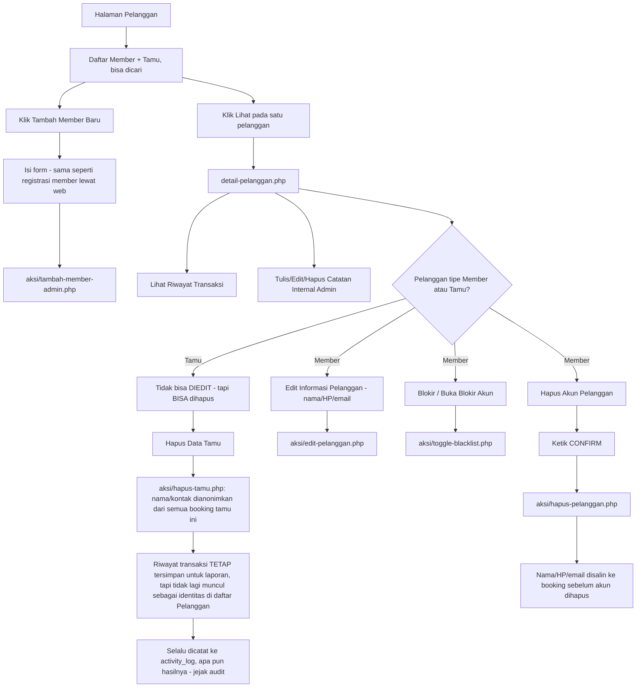

**Kenapa Tamu bisa dihapus tapi tidak diedit**: Tamu tidak punya baris akun (`users`) sama sekali — cuma kumpulan booking dengan nama/HP yang sama. "Hapus" di sini berarti mengosongkan nama/kontak di seluruh booking tamu itu (bukan menghapus booking-nya), supaya data keuangan/laporan tetap utuh tapi identitasnya tidak lagi muncul sebagai entri "Pelanggan". Tidak ada konsep "edit" karena tidak ada akun yang datanya bisa diubah — kalau tamu itu sebenarnya member, solusinya adalah menautkan lewat fitur deteksi di Kasir (3.4), bukan mengedit data tamu.

### 3.8 Alur Owner — CRUD Manajemen Tim (Owner & Admin Operasional)

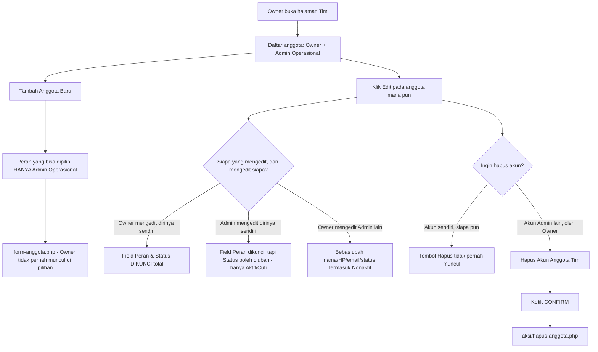

**Catatan role "Kasir"**: peran staf "Kasir" sudah dihapus dari manajemen tim — cuma ada Owner dan Admin Operasional sekarang. ***Fitur*** Kasir (halaman POS/kasir.php untuk transaksi walk-in) TIDAK dihapus, tetap bisa dipakai Owner maupun Admin Operasional — yang dihapus hanya kemampuan menugaskan seseorang secara khusus sebagai "peran Kasir" yang terbatas.

### 3.9 Alur Member — Pengaturan Akun Sendiri

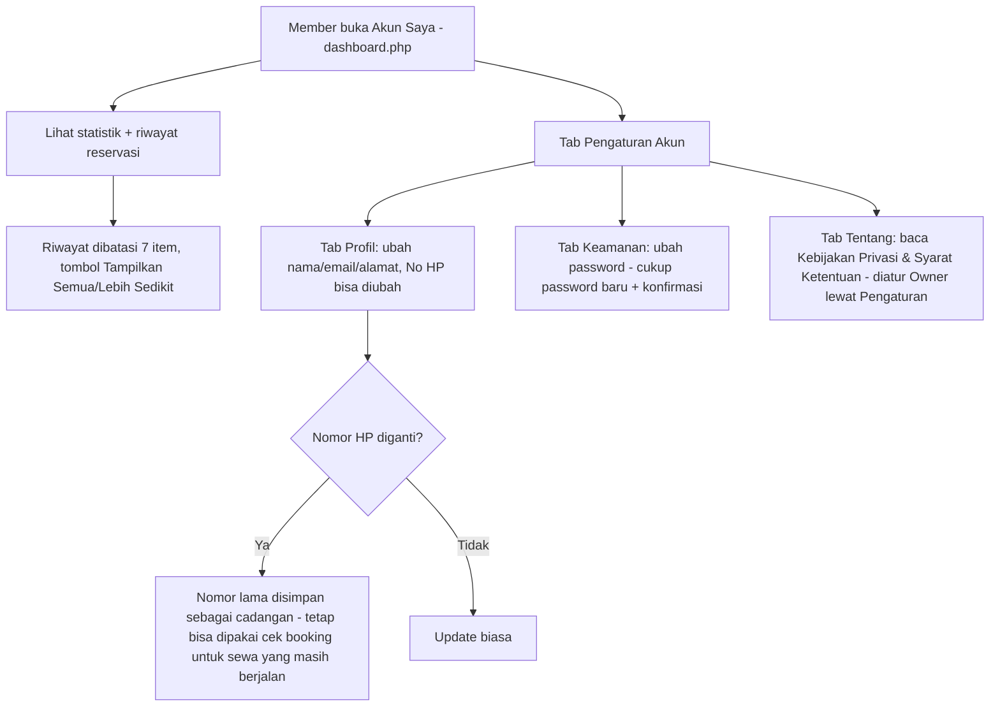

### 3.10 Alur Admin/Owner — Profil Diri Sendiri

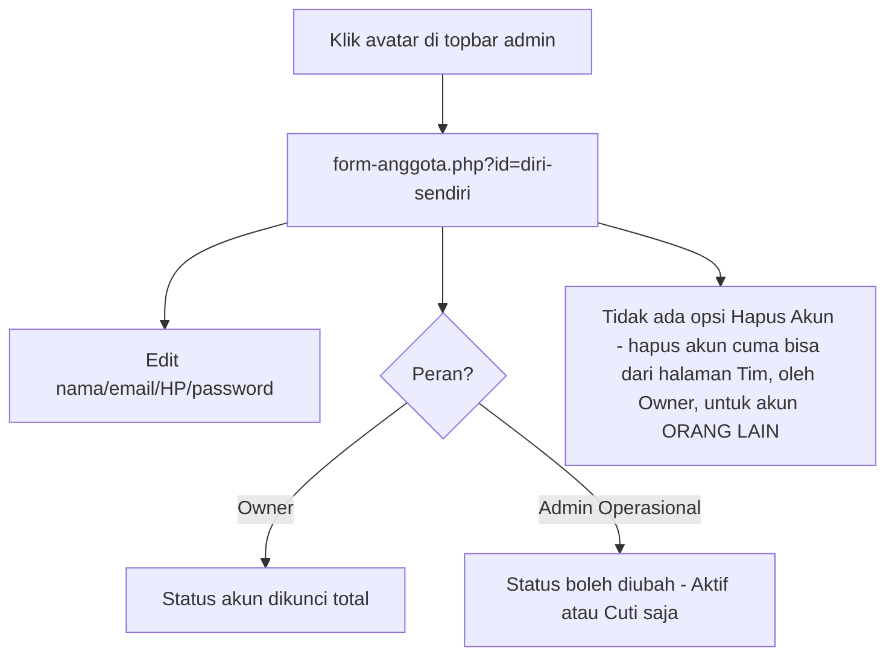

### 3.11 Alur Registrasi & Login

```mermaid
flowchart TD
    subgraph REGISTER["Registrasi Member"]
        R1[Isi nama, No HP, alamat domisili, email opsional, password] --> R2[Validasi format No HP Indonesia]
        R2 --> R3[Validasi format email jika diisi]
        R3 --> R4[Cek duplikat No HP/email]
        R4 --> R5[Rate limit: maks 5 percobaan registrasi/jam per IP]
        R5 --> R6[Honeypot field - deteksi bot]
        R6 --> R7[Password di-hash bcrypt cost 12]
        R7 --> R8[Akun dibuat, status aktif]
    end

    subgraph LOGIN["Login Member"]
        L1[Isi Nomor HP atau Email + Password] --> L2{Akun dikunci - 5x gagal?}
        L2 -->|Ya| L3[Tolak, tampilkan sisa waktu lockout]
        L2 -->|Tidak| L4[Cari user by no_hp ATAU email]
        L4 --> L5[password_verify - selalu jalan meski akun tidak ada]
        L5 --> L6{Password cocok & akun aktif?}
        L6 -->|Tidak| L7[Catat percobaan gagal, pesan generik]
        L6 -->|Ya| L8[session_regenerate_id]
        L8 --> L9[Redirect ke Dashboard]
    end

    subgraph ADMINLOGIN["Login Admin/Owner"]
        A1[URL khusus: workspace-merimba.php] --> A2[Isi Email + Password]
        A2 --> A3[Pola sama persis dengan login member]
    end
```

### 3.12 Alur Keamanan — Validasi Upload File (berlaku untuk semua jenis upload)

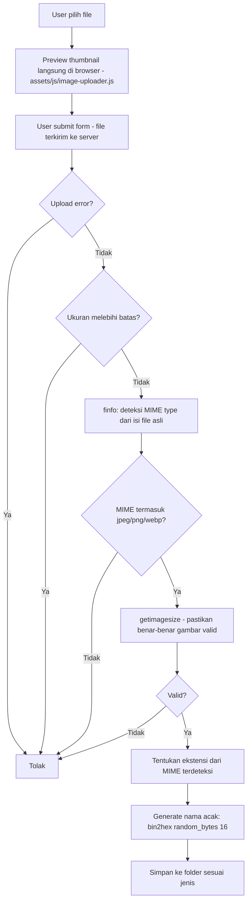

### 3.13 Alur Bisnis — Locking Stok (Anti-Oversell)

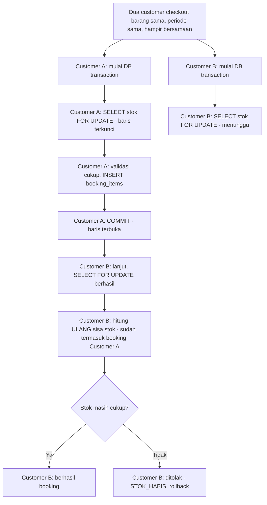

Untuk Pakaian Outdoor, locking yang sama diterapkan per-ukuran (`item_variasi`), supaya dua orang checkout ukuran BERBEDA dari barang yang sama tidak saling memblokir.

---

## 4. Ringkasan Struktur Sistem (untuk orientasi cepat)

- **Tidak ada framework** — PHP native 8.2 + PDO, class statis (`App\Models`, `App\Core`) sebagai pengganti struktur MVC penuh.
- **Path**: seluruh link/asset memakai path RELATIF (tanpa slash di depan) — aman dipindah ke domain/subfolder mana pun tanpa ubah kode (lihat 1.4).
- **Autentikasi**: session PHP + role (`owner`, `admin`, `member` — role `kasir` masih ada di enum database untuk kompatibilitas data lama, tapi sudah tidak bisa ditugaskan lewat Manajemen Tim; halaman/fitur Kasir tetap bisa dipakai Owner & Admin). Setiap halaman admin memanggil `Auth::requireRole([...])` di baris paling atas.
- **Database**: database produksi InfinityFree / database lokal untuk development, semua akses lewat `App\Core\Database::getConnection()` (PDO, prepared statement wajib).
- **Upload**: `app/Helpers/upload.php` (validasi backend) + `assets/js/image-uploader.js` (preview & hapus di sisi client, dipakai seragam di semua halaman upload).
- **CSRF**: `generate_csrf_token()` / `verify_csrf_token()` di `app/Helpers/security.php`, dipasang di semua form POST.
- **Sistem varian ukuran** (Pakaian Outdoor): tabel `item_variasi` (stok per ukuran) + `booking_items.ukuran_dipilih`, independen dari sistem stok biasa (`items.stok_total`).
- **Icon**: satu file sprite `assets/icons/sprite.svg` (52 simbol), dipanggil lewat `<use href="assets/icons/sprite.svg#nama-icon">` di seluruh project — konsisten satu bahasa desain.
- **Favicon**: `assets/icons/favicon.svg` — huruf "M" putih di atas coklat tema web.
- **Kolom tambahan `users`**: `alamat` (wajib diisi, domisili saat ini), `no_hp_lama` (cadangan otomatis saat member ganti nomor, lihat 1.3).
- **Setting dinamis** (tabel `settings`, key-value): profil usaha, logo, QRIS, DAN `kebijakan_privasi` / `syarat_ketentuan` (ditulis Owner lewat Pengaturan, ditampilkan di tab Tentang halaman akun member).

---

## 5. Database lewat phpMyAdmin

### 5.1 Cara buka phpMyAdmin

- **Lokal (server development)**: buka phpMyAdmin lewat panel kontrol server lokal (mis. XAMPP Control Panel → tombol Admin di baris MySQL), pilih database lokal project ini di panel kiri.
- **Produksi (InfinityFree)**: Control Panel → **Manage merimbaoutdoor.gt.tc** → **MySQL Databases** → klik tombol **phpMyAdmin** di sebelah database produksi. Tidak perlu login manual, InfinityFree langsung meneruskan sesi yang sudah terautentikasi.

Begitu masuk, panel kiri phpMyAdmin menampilkan daftar semua tabel. Klik satu tabel untuk lihat isinya (tab **Browse**), ubah strukturnya (tab **Structure**), atau jalankan query manual (tab **SQL**).

### 5.2 Semua tabel dan fungsinya

| Tabel | Isinya | Baris pertama biasanya dari |
|---|---|---|
| `users` | Semua akun: Owner, Admin Operasional, dan Member. Dibedakan lewat kolom `role`. Kolom penting: `nama`, `email`, `no_hp` (unik), `no_hp_lama` (cadangan saat ganti nomor), `alamat`, `password_hash` (bcrypt, JANGAN pernah diisi manual dengan password polos), `role`, `status_aktif` (`aktif`/`cuti`/`nonaktif`). | Registrasi member lewat web, atau Owner menambah Admin lewat halaman Tim. |
| `settings` | Pengaturan situs dalam format key-value (satu baris = satu pengaturan): nama usaha, alamat, WhatsApp, Instagram, jam operasional, logo, gambar QRIS, `kebijakan_privasi`, `syarat_ketentuan`. | Diisi Owner lewat halaman Pengaturan. |
| `items` | Katalog barang yang disewakan (nama, kategori, harga per malam, deskripsi, status aktif/maintenance/nonaktif). Untuk barang non-Pakaian Outdoor, stok ada langsung di kolom `stok_total`. | Admin/Owner menambah barang lewat Inventaris. |
| `item_variasi` | Stok per UKURAN, khusus kategori Pakaian Outdoor (S/M/L/XL, dst). Terhubung ke `items` lewat `item_id`. | Otomatis saat menambah barang kategori Pakaian Outdoor. |
| `item_images` | Foto-foto tiap barang (bisa lebih dari satu per barang), terhubung ke `items` lewat `item_id`, urutan tampil diatur kolom `urutan`. | Upload foto lewat form Tambah/Edit Barang. |
| `bookings` | Setiap reservasi/transaksi sewa — baik dari member (`user_id` terisi), tamu (`guest_nama`/`guest_hp`/dll terisi, `user_id` kosong), maupun walk-in kasir yang ditautkan ke member (`user_id` DAN `guest_*` sama-sama terisi). Kolom `status` melacak tahapan (DRAFT sampai SELESAI). Kolom `tanggal_ambil`/`tanggal_kembali`/`jam_ambil`/`jam_kembali` di sini adalah **amplop (envelope)** — otomatis MIN/MAX dari tanggal seluruh `booking_items` di dalamnya (`jam_ambil` dari barang yang diambil paling awal, `jam_kembali` dari barang yang kembali paling akhir), bukan sumber kebenaran utama lagi sejak tiap barang bisa punya periode sewa sendiri. | Checkout customer di web atau transaksi di halaman Kasir, dihitung ulang otomatis tiap kali barang ditambah/diperpanjang. |
| `booking_items` | Rincian barang, jumlah, DAN periode sewanya sendiri (`tanggal_ambil`/`tanggal_kembali`/`jam_ambil`) — satu booking bisa berisi barang dengan durasi sewa berbeda-beda. Kolom `status` (`disewa`/`dikembalikan`) melacak apakah barang itu sendiri sudah dikembalikan; stok barang baru terhitung "lepas" begitu status ini jadi `dikembalikan`, terlepas dari status barang lain di booking yang sama. | Otomatis saat booking dibuat; `status` berubah lewat Pengembalian per-barang. |
| `transactions` | Catatan pembayaran (DP/pelunasan/denda), terhubung ke `bookings`. Kolom `status_verifikasi` (menunggu/terverifikasi/ditolak) khusus untuk pembayaran QRIS mandiri yang perlu dicek Admin. | Pembayaran customer atau kasir. |
| `returns` | Catatan pengembalian — satu baris = satu barang yang dikembalikan (`booking_item_id`), lengkap dengan kondisi & biaya keterlambatan/kerusakan barang itu sendiri. Baris lama (sebelum fitur per-barang) punya `booking_item_id` kosong (NULL) karena dulu satu baris mewakili seluruh booking. | Admin memproses pengembalian per barang. |
| `catatan_pelanggan` | Catatan internal staf tentang pelanggan tertentu (disimpan per nomor HP, bukan per akun — supaya tetap nyambung meski pelanggannya tamu). | Ditulis Admin/Owner lewat halaman Detail Pelanggan. |
| `notifications` | Notifikasi lonceng di panel admin (booking baru, dsb.), terhubung ke `users`. | Otomatis oleh sistem. |
| `activity_log` | Jejak audit: siapa melakukan apa dan kapan (login, hapus barang, hapus data tamu, ubah pengaturan, dst). **Jangan dihapus manual** kecuali memang perlu membersihkan data lama — ini bukti audit. | Otomatis oleh sistem di hampir semua aksi penting. |
| `login_attempts` | Percobaan login gagal, dipakai untuk rate-limiting (kunci akun 5 menit setelah 5x gagal). Aman dikosongkan kapan saja kalau perlu, tidak memengaruhi data bisnis. | Otomatis oleh sistem. |
| `registration_attempts` | Sama seperti di atas tapi untuk percobaan registrasi (mencegah bot spam daftar akun). | Otomatis oleh sistem. |
| `backup_bukti_pembayaran` | Riwayat backup ZIP bukti pembayaran (fitur Backup di halaman Pengaturan, khusus Owner). Kolom `cutoff_at` adalah batas waktu upload yang tercakup di backup itu, dipakai juga sebagai batas aman saat Arsip menghapus file fisiknya. `diarsipkan_at` terisi kalau backup itu sudah pernah diarsipkan (NULL kalau belum). | Owner menekan tombol Backup Bukti Pembayaran. |

### 5.3 Tugas umum di phpMyAdmin

**Import struktur database dari nol** (dipakai saat setup awal hosting, lihat 2.4): pilih database → tab **Import** → pilih file `database/schema.sql` → **Go**. Ini hanya membuat tabel kosong, tidak ada data contoh.

**Bikin/ubah akun Owner tanpa lewat aplikasi** (kalau lupa password Owner misalnya): tab **SQL**, jalankan:
```sql
UPDATE users SET password_hash = 'HASH_BCRYPT_BARU' WHERE role = 'owner';
```
Hash bcrypt dibuat lewat `php -r "echo password_hash('password_baru', PASSWORD_BCRYPT, ['cost'=>12]);"` — JANGAN pernah menaruh password polos langsung di kolom `password_hash`, aplikasi tidak akan bisa memverifikasinya dan itu juga tidak aman.

**Lihat/hapus data percobaan (testing) setelah deploy**: klik tabel `bookings` → **Browse** → hapus baris yang statusnya jelas data uji coba (pakai centang di kiri tiap baris → **Delete**, atau tab **SQL** untuk hapus banyak sekaligus lewat `WHERE`). Ingat urutan penghapusan kalau hapus manual lewat SQL: `booking_items`, `transactions`, `returns` dulu (semuanya `ON DELETE CASCADE` ke `bookings`, jadi sebenarnya cukup hapus baris di `bookings` saja dan sisanya otomatis ikut terhapus).

**Backup manual** (karena tombol Backup di aplikasi kemungkinan tidak jalan di hosting gratis, lihat 2.6): pilih database → tab **Export** → **Quick** → format **SQL** → **Go**, file `.sql` akan terunduh ke komputer.

**Cek data tanpa login ke aplikasi**: tab **SQL** lalu jalankan `SELECT` biasa, misalnya `SELECT nama, no_hp, role, status_aktif FROM users;` untuk lihat semua akun, atau `SELECT * FROM bookings ORDER BY created_at DESC LIMIT 20;` untuk 20 booking terbaru.

### 5.4 Relasi antar tabel (kalau perlu hapus data manual)

| Tabel anak | Kolom | Merujuk ke | Kalau induknya dihapus |
|---|---|---|---|
| `booking_items` | `booking_id` | `bookings.id` | Ikut terhapus otomatis (CASCADE) |
| `booking_items` | `item_id` | `items.id` | **Ditolak** kalau barang itu pernah dipesan (RESTRICT) — barang dengan riwayat sewa cuma bisa dinonaktifkan, tidak bisa dihapus permanen |
| `transactions` | `booking_id` | `bookings.id` | Ikut terhapus otomatis (CASCADE) |
| `returns` | `booking_id` | `bookings.id` | Ikut terhapus otomatis (CASCADE) |
| `item_images` | `item_id` | `items.id` | Ikut terhapus otomatis (CASCADE) |
| `item_variasi` | `item_id` | `items.id` | Ikut terhapus otomatis (CASCADE) |
| `notifications` | `user_id` | `users.id` | Ikut terhapus otomatis (CASCADE) |
| `bookings` | `user_id` | `users.id` | Kolom di-kosongkan jadi NULL (SET NULL) — booking-nya TIDAK ikut terhapus, cuma jadi tidak terhubung ke akun |
| `activity_log` | `user_id` | `users.id` | Sama, di-set NULL, log-nya tetap ada |
| `catatan_pelanggan` | `dibuat_oleh` | `users.id` | Sama, di-set NULL |
| `returns` | `diproses_oleh` | `users.id` | Sama, di-set NULL |
| `transactions` | `diproses_oleh` | `users.id` | Sama, di-set NULL |
| `returns` | `booking_item_id` | `booking_items.id` | Kolom di-kosongkan jadi NULL (SET NULL) — baris riwayat pengembaliannya TIDAK ikut terhapus |

Artinya: **menghapus satu baris `bookings` lewat phpMyAdmin sudah otomatis membereskan `booking_items`/`transactions`/`returns` terkait** — tidak perlu hapus manual satu-satu. Tapi menghapus `users` atau `items` yang masih dipakai di riwayat TIDAK menghapus riwayatnya, sesuai desain (supaya laporan lama tidak pernah kehilangan data).
